# VIRTUAL BEINGS Unity Humanoid Being

 [**VIRTUAL BEINGS Hub on Discord**](https://discord.gg/raHeeqbh)

## Requirements
- Unity Version 2021.3 or higher
- Universal Render Pipeline Unity project
- [Git](https://git-scm.com/)
- [VIRTUAL BEINGS Tech Unity package](https://github.com/VIRTUALBEINGS/virtualbeingstech-unity)

## How to import Humanoid Being package into your Unity project
- Open Package Manager windows in Unity : `Window > Package Manager`.

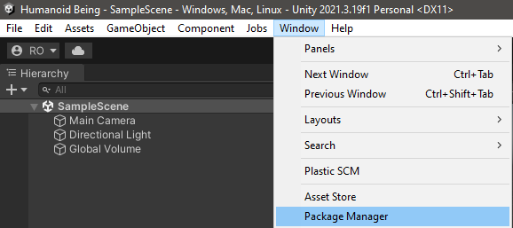

- Click on the `+` icon and select `Add package from git URL...`.

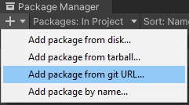

- Paste this link : `https://github.com/VIRTUALBEINGS/beings-humanoid-unity.git`

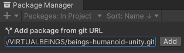

- Click `Add` and wait until the import is finished

## Quickstart
**1.** Open `Virtual Beings > Settings` and set up your key. If you don't have one, you can use "Demo".

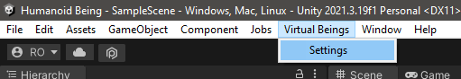

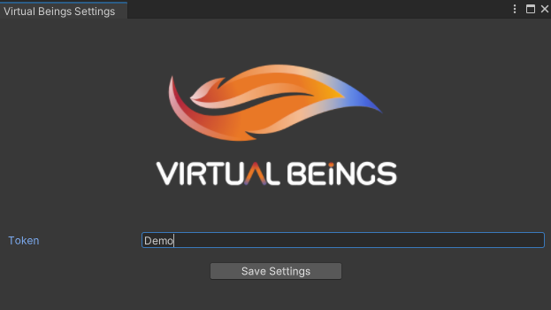

**2.** Download the QuickStart sample from the package manager.

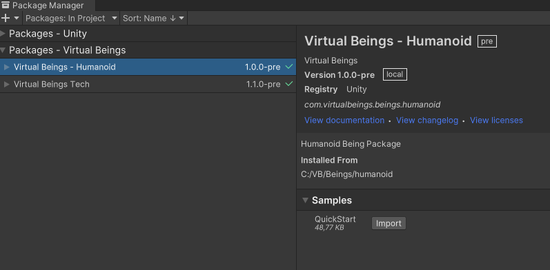

**3.** Open the scene from the sample.

**4.** Select the BeingsInstallerSettings in the sample folder, and fill the `Virtual Being Settings` field with the corresponding asset in your project folder.

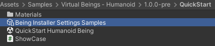

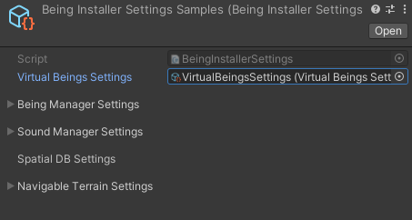

**5.** You can now start the scene

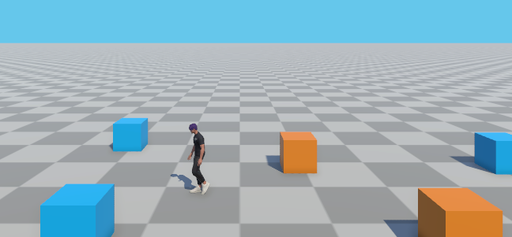

## (Optional) Import your own ReadyPlayerMe Being

### Requirements

- [RPM Unity Core](https://github.com/readyplayerme/rpm-unity-sdk-core)

### Create your Being

**1.** Import ReadyPlayerMe avatar loading sample

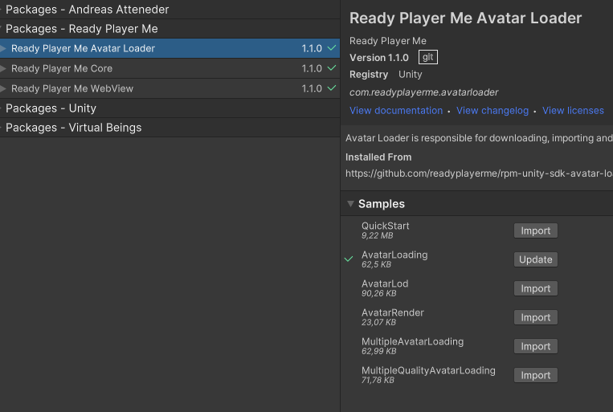

**2.** Open Avatar Loader windows :  `Ready Player Me > Avatar Loader`

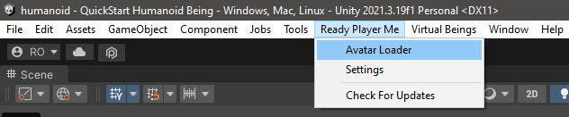

**3.** Import your RPM avatar into the current scene

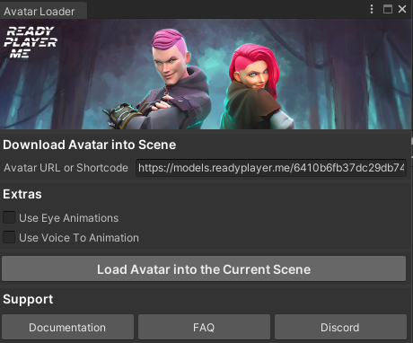

**4.** Open your new avatar prefab, and add `PostProcessAnimationHumanoid.cs` script at the root prefab

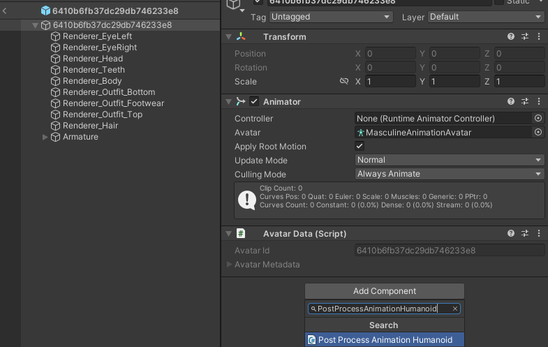

**5.** On the `PostProcessAnimationHumanoid` component, configure your avatar as a being by :
- Filling the `Being Shared Settings` field
- Click on `1 - Create Being`
- Click on `2 - Create Colliders`
- Click on `3 - Create Drivers`

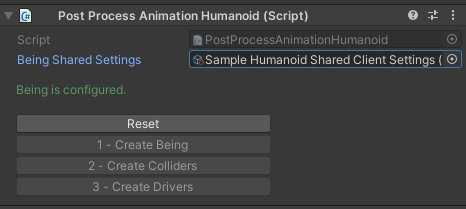

Your new Being is now ready. You can use it in the QuickStart scene by replacing the being prefab on the `Being Installer Settings Sample`.

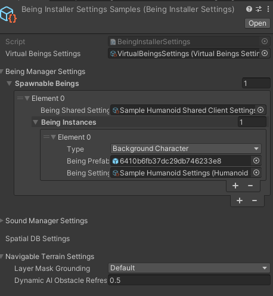
